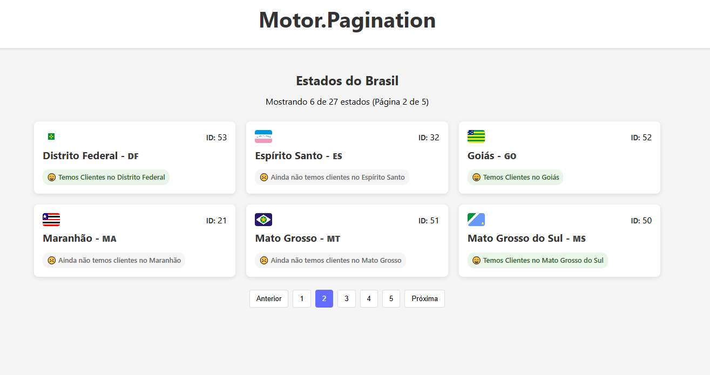

# Motor Pagination Frontend

## 🧰 Tecnologias

- React
- TypeScript
- JSON Server
- Vite
- Axios
- CSS purão

## ⚙️ Instalação

1. Clone o repositório
2. Instale as dependências com `npm install`
3. Inicie o servidor JSON com `npm run server`
4. Inicie o servidor de desenvolvimento com `npm run dev`
